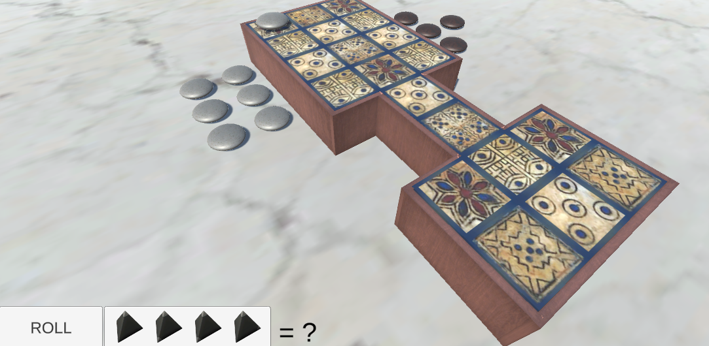

# Royal Game of UR

## Instructions

Click Roll to see how many squares you are allowed to move (0-4 based on the tetrahedron dice).
* 2 is the most likely roll, keep this in mind when playing.

Click on one of the player's stones. It will move towards the goal with the Rolled amount, if a legal move is possible. 

Landing on a Rosette square allows you to roll again, plus it is a safe square - the enemy cannot remove your stone - they cannot move on top of the same square.

The middle lane is the only one where the enemy can remove your stones, all other squares are safe squares.